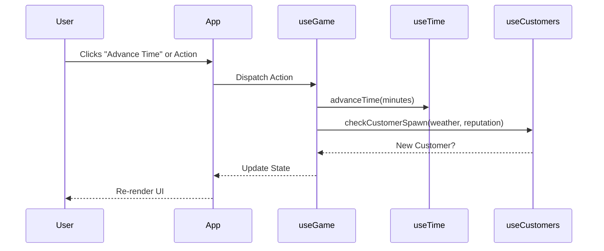

# System Architecture

This document outlines the technical architecture of BaristaSim.

> **How to use this doc**: Mark your understanding of each section using the checkboxes.
> - [ ] **Reviewed**: You have read the section.
> - [ ] **Understood**: You comprehend the logic and structure.
> - [ ] **Unclear**: Needs revisiting or clarification.

---

## 1. High-Level Architecture
<details>
<summary><strong>Click to Expand</strong></summary>

### Overview
BaristaSim uses a **component-based architecture** powered by React. The game state is centralized and managed via custom hooks, following a **unidirectional data flow**.

### Tech Stack
- **Framework**: [React](https://react.dev/) (Functional Components + Hooks)
- **Build Tool**: [Vite](https://vitejs.dev/)
- **Styling**: [CSS Modules](https://github.com/css-modules/css-modules) + Vanilla CSS Variables
- **State Persistence**: `localStorage`

### Component Diagram
```mermaid
graph TD
    App[App.jsx] --> Provider[GameProvider / useGame]
    App --> HUD[HUD.jsx]
    App --> Visuals[BrewingVisuals.jsx]
    App --> Controls[BrewingControls.jsx]
    App --> Modals[Modals (Shop, Inventory, etc.)]
    
    subgraph Data Flow
        Provider -->|State & Actions| HUD
        Provider -->|State & Actions| Visuals
        Provider -->|State & Actions| Controls
        Provider -->|UI State| Modals
    end
```

### Understanding Check
- [ ] Reviewed
- [ ] Understood
- [ ] Unclear

</details>

---

## 2. Core Game Loop & State
<details>
<summary><strong>Click to Expand</strong></summary>

### The Game Hook (`useGame`)
The entire game logic is encapsulated in the `useGame` hook. This acts as the "Game Engine". It aggregates smaller hooks to manage specific domains.

#### Sub-Hooks Pattern
We use **Composition** to split logic:
- `useTime.js`: Manages the day/night cycle and game clock.
- `useInventory.js`: Tracks beans, milk, money, and upgrades.
- `useCustomers.js`: Handles customer generation, patience, and orders.
- `useBrewing.js`: Manages the state of the drink currently being made.

### Game Loop Flow
The game runs on a "Tick" system (often driven by interactions or a timer for time progression).



### Techniques Used
- **Custom Hooks**: specialized logic containers.
- **Dependency Injection**: `useGame` injects dependencies (like `time` into `customers`) implicitly by coordinating them.

### Understanding Check
- [ ] Reviewed
- [ ] Understood
- [ ] Unclear

</details>

---

## 3. UI/UX & Styling Philosophy
<details>
<summary><strong>Click to Expand</strong></summary>

### The "Coffee Menu" Aesthetic
We use a SKEUOMORPHIC design approach for menus.
- **Class**: `.coffee-menu` (formerly `.intro-menu`)
- **Style**: Parchment background (`#fffaf0`), Double wood borders, specialized typography (`VT323`).

### CSS Architecture
We avoid CSS-in-JS libraries in favor of **CSS Modules** and **Global Variables**.
- `base.css`: Variables (`--primary-color`), Reset.
- `layout.css`: Grid/Flex structures for the main game container.
- `menus.css`: Shared modal styles.
- `components.css`: specific component styles.

### Z-Index Strategy
To ensure correct layering:
1.  **Background**: `z-index: 0`
2.  **Visual Area**: `z-index: 2`
3.  **Decorations**: `z-index: 6`
4.  **HUD**: `z-index: 100-2000`
5.  **Modals/Overlays**: `z-index: 5000` (Topmost)

### Understanding Check
- [ ] Reviewed
- [ ] Understood
- [ ] Unclear

</details>

---

## 4. Modal System
<details>
<summary><strong>Click to Expand</strong></summary>

### Modal Components
All pop-ups (Shop, Inventory, Debug) are wrapped in a generic `Modal` component.
- **Path**: `src/components/Modal.jsx`
- **Props**: `isOpen`, `onClose`, `title`.
- **Children**: The content of the modal.

 This ensures consistent:
1.  **Overlay**: Dimmed background (`.menu-overlay`).
2.  **Animation**: `slide-up-fade`.
3.  **Close Behavior**: "X" button and backdrop clicking (if implemented).

### Renaming Refactor
We recently standardized naming to `*Modal.jsx` (e.g., `ShopModal.jsx`) to clearly distinguish full-screen views from partial components.

### Understanding Check
- [ ] Reviewed
- [ ] Understood
- [ ] Unclear

</details>

---

## 5. Development Patterns
<details>
<summary><strong>Click to Expand</strong></summary>

### "Fix First" Strategy
We prioritize fixing broken features before adding new ones. This is tracked in `Design/Fix_First.md`.

### Artifacts (The "Brain")
- `task.md`: Active todo list.
- `implementation_plan.md`: Design before code.
- `walkthrough.md`: Proof of completion.

### Understanding Check
- [ ] Reviewed
- [ ] Understood
- [ ] Unclear

</details>
